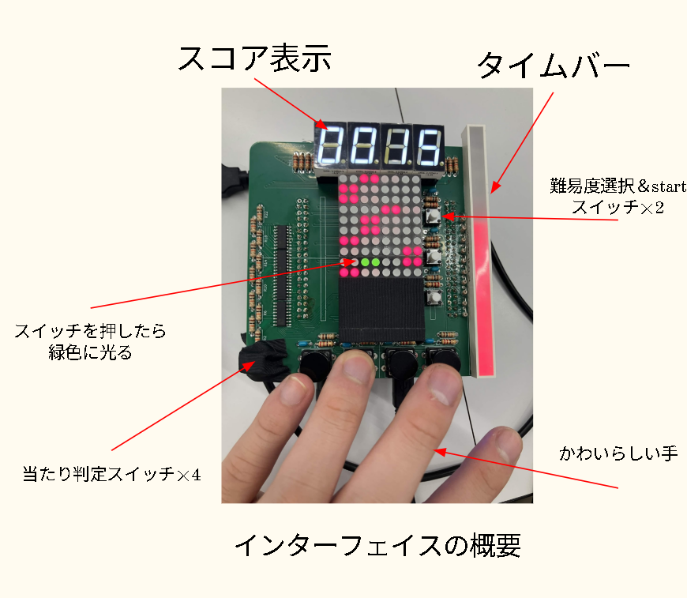

# 動いている様子 (押したらリンク飛べます)
[](https://www.youtube.com/shorts/dmGggVU54so)
# ハードウェアの説明

# quarutus

DE10-Nano + FPGAPiano シールド（回路図 rev2）向けの **ピンアサイン／極性確認用 Quartus Prime プロジェクト**です。
シールド上の各出力（行・列・7セグ・桁・プログレスバー・緑LED）が正しい端子と正しい極性で光るかどうかを、
実機上で目視確認するためのテスト回路 `pin_test_top` を収録しています。

## 構成

| ファイル/フォルダ | 内容 |
|---|---|
| `pin_test_top.v` | トップモジュール（Verilog）。ピン確認用のスキャン表示ロジック |
| `pin_test.qpf` | Quartus Prime プロジェクトファイル（Revision: `pin_test`） |
| `pin_test.sdc` | タイミング制約（50MHz クロック、入出力は目視確認用のため false path） |
| `pin_test.sof` | コンパイル済みコンフィギュレーションファイル（FPGA書き込み用） |
| `pin_test.cdf` | JTAG書き込み用チェインファイル |
| `pin_test.pin` | Fitter によるピン配置結果（レポート用） |
| `pin_test.fit.rpt` / `pin_test.map.rpt` / `pin_test.sta.rpt` 等 | Fit/Map/タイミング解析レポート |
| `FPGAPiano_sch_rev2.pdf` | FPGAPianoシールドの回路図（rev2） |
| `FIX_NOTES.md` | ピン配置ミスや出力極性の調整履歴（修正ログ） |
| `db/`, `incremental_db/` | Quartus Prime のコンパイル中間生成物（自動生成） |

## 対象デバイス

- ボード: **Terasic DE10-Nano**
- FPGA: **Intel Cyclone V `5CSEBA6U23I7`**
- 開発環境: **Quartus Prime 25.1 std (Lite Edition)**

## `pin_test_top` の動作概要

`mode_sw[2:0]`（タクトスイッチ、押した瞬間だけHigh）で表示モードを切り替えます。
モードは押している間だけでなく、次に別のスイッチが押されるまで保持されます。

| モード | 状態名 | 内容 |
|---|---|---|
| `mode_sw[0]` 立ち上がり | `ST_ROWCOL` | 行×列（LEDマトリクス）を1本ずつ順にスキャン点灯 |
| `mode_sw[1]` 立ち上がり | `ST_DIGSEG` | 桁×7セグメントを1本ずつ順にスキャン点灯 |
| `mode_sw[2]` 立ち上がり | `ST_BAR` | プログレスバー（10本）を1本ずつ順に点灯 |

また、`sw_in[0:3]` を押している間は、対応する行の位置で緑LED（`m_c8g`）が点灯します。
通常表示（行×列）とスイッチ表示（緑LED）は、内部で高速に時分割（phase切り替え）されており、
互いに干渉せず同時に見えるようになっています。

### モジュールI/O

```verilog
module pin_test_top #(
    parameter CLK_HZ  = 50_000_000,
    parameter AL_ROW  = 0, // 行の出力極性 (1=Active Low)
    parameter AL_COL  = 0, // 列の出力極性
    parameter AL_SEG  = 0, // 7セグの出力極性
    parameter AL_DIG  = 0, // 桁の出力極性
    parameter AL_BAR  = 0, // バーの出力極性
    parameter STEP_HZ = 5  // 1ステップ(1本点灯)を切り替える速度[Hz]
)(
    input  wire        clk,
    input  wire        rst_n,
    input  wire [3:0]  sw_in,     // 緑LED手動点灯用スイッチ
    input  wire [2:0]  mode_sw,   // 表示モード切替スイッチ

    output wire [3:0]  m_r,       // 行
    output wire [9:0]  m_c,       // 列
    output wire        m_c8g,     // 緑LED
    output wire [6:0]  seg,       // 7セグメント
    output wire [3:0]  dig,       // 7セグ桁選択
    output wire [9:0]  p          // プログレスバー
);
```

### 出力の極性（実機確認済み）

| グループ | 駆動方式 | 極性 | パラメータ |
|---|---|---|---|
| 行 `m_r` | PチャネルFET (ハイサイド) | Active Low | `AL_ROW = 1` |
| 列 `m_c` | DRV777 (シンク) | Active High | `AL_COL = 0` |
| 緑 `m_c8g` | DRV777 (シンク) | Active High | `AL_COL = 0` |
| 7セグ `seg` | PチャネルFET | Active Low | `AL_SEG = 1` |
| 桁 `dig` | (暫定) | Active Low | `AL_DIG = 1` |
| バー `p` | (暫定) | Active High | `AL_BAR = 0` |

実機で光り方がおかしい場合は、光らないグループの `AL_xxx` パラメータを反転して再コンパイルしてください
（詳細な調整手順は [`FIX_NOTES.md`](./FIX_NOTES.md) を参照）。

## ピン割り当て（抜粋）

Fitter 結果（`pin_test.pin`）に基づく主要信号のピン配置です。

| 信号 | ピン |
|---|---|
| `clk` | V11 |
| `rst_n` | AH17 |
| `sw_in[0]` | AG15 |
| `sw_in[1]` | AE20 |
| `sw_in[2]` | AE19 |
| `sw_in[3]` | AE17 |
| `mode_sw[0]` | Y15 |
| `mode_sw[1]` | AC24 |
| `mode_sw[2]` | AH19 |

行 (`m_r`)・列 (`m_c`)・7セグ (`seg`)・桁 (`dig`)・バー (`p`)・緑LED (`m_c8g`) の全ピンは
`pin_test.pin` を参照してください。ハードウェア側の詳細な信号対応は `FPGAPiano_sch_rev2.pdf` を参照してください。

## 使い方

1. Quartus Prime 25.1 (Lite Edition以上) で `pin_test.qpf` を開く
2. 必要に応じて `pin_test_top.v` の `AL_xxx` パラメータを調整
3. Compile（Analysis & Synthesis → Fitter → Assembler）を実行し、`pin_test.sof` を生成
4. DE10-NanoにFPGAPianoシールドを接続した状態で、JTAG経由（`pin_test.cdf`）で書き込み
5. `mode_sw` でモードを切り替えながら、各出力が正しい位置・正しい極性で光ることを確認

## 実装状況（コンパイル結果より）

- Fitter: **Successful**
- Logic utilization: 78 / 41,910 ALMs（1%未満）
- Total registers: 85
- Total pins: 45 / 314（14%）
- 動作クロック: 50MHz（`create_clock -period 20.000`）

## 既知の修正履歴

過去に発生したピン配置エラーや極性の確定経緯は [`FIX_NOTES.md`](./FIX_NOTES.md) にまとめられています。

- `sw_in[1]/sw_in[3]/rst_n` のGPIOテーブル読み取りミスによるFitterエラーの修正
- `m_c8g` のビット幅誤り（4bit→1bit、DRV777は1入力のため）の修正
- 各出力グループの極性（Active High/Low）の実機確認による確定

# PCBデータ

KiCad 9.0で作成しています。

## 修正事項
7セグの配線に間違いがあり、ラベル名と7セグのピン名が入れ替わっている部分がありますが、公開しているverilogのピンアサインで動くように修正してあります（動くはずです）。

# ライセンス

このプロジェクトは [MIT License](./LICENSE) の下で公開されています。
改変・再配布・商用利用を含め自由に利用できます（著作権表示とライセンス文の保持のみ必須）。
